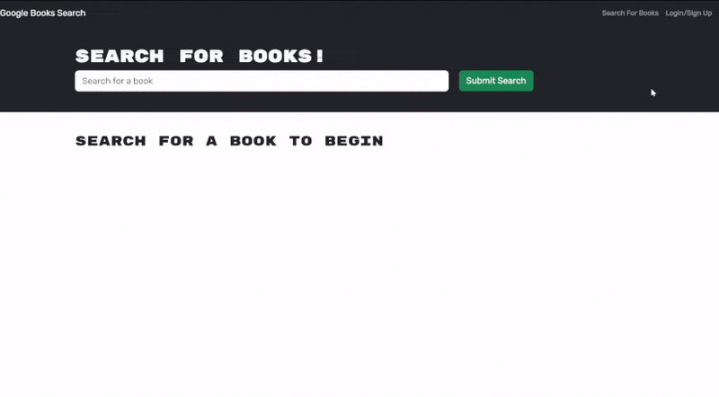
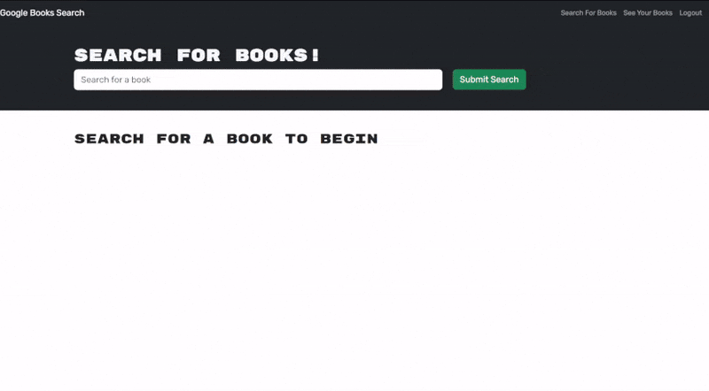
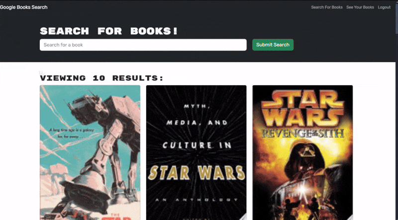
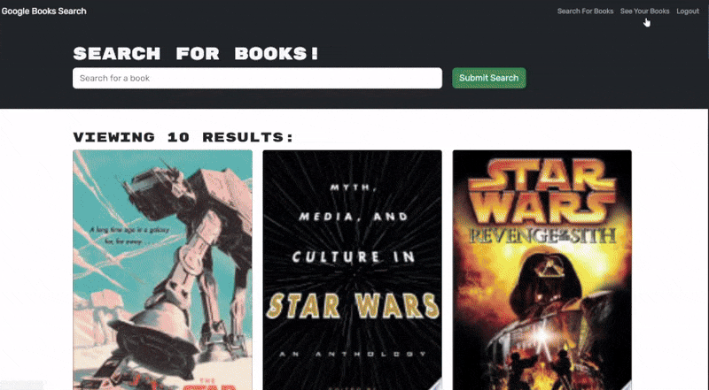
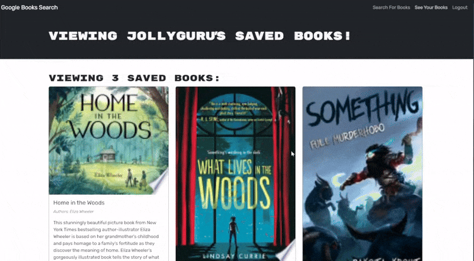

# Google Book Search


## Description

Explore a vast collection of books with the Google Books API. Easily search for titles, authors, or genres that interest you, and save your favorite finds to your personal profile for future reference.

## Table of Contents

- [Installation](#installation)
- [Usage](#usage)
- [Questions](#questions)
- [Credits](#credits)

## Installation

If you want to use the app, go to [this url](https://book-search-engine-kacs.onrender.com) and follow the instructions under the [Usage](#usage) tab. If you want to run this app on your local machine, follow these instructions:

Resources:

- [Node Installation](https://nodejs.org/en/download/package-manager)
- [MongoDB Installation](https://coding-boot-camp.github.io/full-stack/mongodb/how-to-install-mongodb)
- [Generate JWT Secret Key](https://pinetools.com/random-string-generator)

```shell
# Step 1: clone this repository
git clone https://github.com/Dan-Swarts/Book-Search-Engine
cd Book-Search-Engine

# Step 2: install dependencies
npm ci

# Step 3: configure environment variables
# remove the '.EXAMPLE' from '.env.EXAMPLE' in the server
# folder. follow the mongodb instructions above, and
# fill in the MONGODB_URI. Generate a JWT Secret
# key using the resource linked above, and fill
# in JWT_SECRET_KEY.

# Step 4: build the program
npm run build

# Step 5: run the program
npm run start
```

## Usage

visit [this URL](https://book-search-engine-kacs.onrender.com), then follow these instructions:

- Login or sign up


<br>
<br>
<br>

- Search for books


<br>
<br>
<br>

- Save books to your account


<br>
<br>
<br>

- See all saved books in your account


<br>
<br>
<br>

- Delete books from your account



## Questions

If you have any questions about Google Book Search, contact me at example@something.com.

Check out my other projects at https://github.com/Dan-Swarts.

## Credits

- [Daniel Swarts](https://github.com/Dan-Swarts)
- [NorthWestern Bootcamp Team](https://sps.northwestern.edu/professional-development/)
